<div align="center">
  
</div>

<div align="center">

[;%F0%9F%8F%86+IEEE+SA+Hackathon+2026+%E2%80%94+1st%2F190+teams+%7C+34+countries+%7C+%245K;eJPT+Certified+%7C+Bugcrowd+Researcher;Autonomous+Honeynets+%7C+SIEM+Pipelines+%7C+K8s+Security)](https://github.com/karandesai2005)


[](https://elearnsecurity.com)
[](https://github.com/rapid7/rex-socket/pull/80)
[](https://bugcrowd.com/Karan_Desai)
[](mailto:desaikaran.me@gmail.com)

</div>

---

## `$ whoami`

```
┌──────────────────────────────────────────────────────────────────────────┐
│                                                                          │
│  karan@security:~$ whoami                                                │
│                                                                          │
│  ▸ B.Tech CS @ Symbiosis Institute of Technology, Pune ('27)            │
│  ▸ eJPT-certified penetration tester                                    │
│  ▸ Shipped production Ruby to Metasploit Framework (PR #80,            │
│    rex-socket · 50k+ ⭐ · cross-platform socket binding for DHCP)       │
│  ▸ 🏆 IEEE SA Cybersecurity Hackathon 2026 — 1st Place                 │
│    $5,000 prize · 190 teams · 34 countries                              │
│  ▸ Cybersecurity Co-Lead @ ACM SIT Pune                                │
│  ▸ Active Bugcrowd researcher — SAML 2.0 / SSO attack vectors          │
│  ▸ Building autonomous honeynets, SIEM pipelines, sandboxed             │
│    pentest consoles. Running Arch Linux + Hyprland, naturally.          │
│                                                                          │
└──────────────────────────────────────────────────────────────────────────┘
```

- 🔐 I work at the intersection of **offensive security**, **container infrastructure**, and **systems programming**
- 🦀 Contributed production Ruby to [Metasploit Framework / rex-socket](https://github.com/rapid7/rex-socket) — cross-platform interface socket binding for DHCP attack modules (Linux · macOS · Windows). 4-round maintainer review, 0 regressions.
- 🎭 Built **Maya** — an autonomous K8s honeynet with PPO-RL, MITRE ATT&CK TTP coverage, CRDT state sync, and ONNX export. **Won 1st Place at IEEE SA Cybersecurity Hackathon 2026** (190 teams, 34 countries, $5K prize).
- 🐛 Active bug bounty research on **Bugcrowd** targeting SAML 2.0 SSO attack vectors (XML signature wrapping, auth bypass, session fixation)
- 🏴 CTF player · Home lab operator (Proxmox, pfSense, Splunk) · Open-source lurker turned contributor
- 📫 **desaikaran.me@gmail.com** · [Portfolio](https://karan-desai.vercel.app)

---

## `$ cat /proc/achievements`

<div align="center">

| | Achievement | Impact |
|:---:|:---|:---|
| 🥇 | **IEEE SA Cybersecurity Hackathon 2026 — 1st Place** | 190 teams · 34 countries · $5,000 prize |
| 🔧 | **Metasploit Framework Contributor** (rex-socket PR #80, merged) | 50k+ ⭐ · Production Ruby · 4 review rounds |
| 🐛 | **Bugcrowd Active Researcher** | SAML 2.0 / SSO attack surface · Rapyd |
| 🎓 | **eJPT Certified** — eLearnSecurity / INE | Junior Penetration Tester, 2026 |
| 👥 | **Cybersecurity Co-Lead** @ ACM SIT Pune | 6+ workshops · 150+ students · CTF organiser |

</div>

---

## `$ ls -la ~/projects/`

### 🎭 Maya — Autonomous Deception & Threat Intelligence Framework
`Go` · `Rust` · `Kubernetes` · `PPO Reinforcement Learning` · `MITRE ATT&CK`

> **🏆 IEEE SA Cybersecurity Hackathon 2026 — 1st Place · 190 teams · 34 countries · $5,000**

Autonomous K8s honeynet that dynamically emulates vulnerable services, captures attacker interactions, and generates structured threat intel consumable by SOC pipelines.

- 7-pod Kubernetes cluster with RBAC-enforced network segmentation
- PPO-based RL agent with ONNX-exported model for adaptive attacker response
- 100% MITRE ATT&CK TTP tagging — every attacker action logged and attributed
- CRDT-based distributed state sync across pods + two novel proposed protocols (CDSP · ABIF)

---

### 📡 TraceProbe — Real-Time Log Analysis & Anomaly Detection
`Apache Kafka` · `Apache Flink` · `Go`

Kafka + Flink streaming SIEM pipeline with stateful anomaly detection and real-time alert rules.

- Reduced simulated MTTD by **60%**
- Processed **50,000+ log events/minute** at sub-second latency
- Detection patterns directly applicable to AWS CloudTrail and cloud security monitoring

---

### 🔒 Rootless — Secure Sandboxed Pentesting Console
`Electron` · `FastAPI` · `Go` · `Firejail`

Sandboxed pentesting console that isolates every tool execution via Firejail — no unsafe sudo, no VM overhead.

- 3-tier architecture: Electron UI → FastAPI → Go execution engine
- Least-privilege filesystem restrictions + per-session process isolation
- Sub-100ms tool launch latency with full audit logging

---

### 🛡️ Kubernetes Security Posture Dashboard *(WIP)*
`Falco` · `Trivy` · `GuardDuty` · `RBAC` · `Go` · `React`

Unified K8s security dashboard integrating runtime threat detection, container scanning, EKS findings, and RBAC audit analysis.

- Auto-remediation via Lambda triggers on critical findings
- Removes manual triage for known-pattern violations → faster MTTR

---

## `$ cat /etc/security.conf`

```python
# Security Philosophy — karan@security

PRINCIPLES = {
    "least_privilege":   "every process, every container, every API call",
    "attack_surface":    "fewer moving parts = fewer failure modes",
    "fail_safely":       "design for breach, not just prevention",
    "reproducibility":   "ad-hoc setups are the enemy of good security testing",
}

CURRENT_FOCUS = [
    "SAML 2.0 / SSO attack research (Bugcrowd)",
    "Cloud-native security tooling (K8s, Falco, GuardDuty)",
    "Autonomous deception systems & threat intelligence",
    "VAPT / Red team toolchain development",
]

STACK = {
    "offensive":  ["Metasploit", "Burp Suite", "Nmap", "Wireshark", "Firejail"],
    "defensive":  ["Falco", "Trivy", "Splunk", "Wazuh", "GuardDuty", "OPA"],
    "cloud":      ["AWS", "Azure", "Kubernetes", "Docker", "Proxmox", "pfSense"],
    "languages":  ["Go", "Python", "Ruby", "Rust", "Bash", "C++"],
    "streaming":  ["Apache Kafka", "Apache Flink", "SIEM pipelines"],
}
```

---

## `$ dpkg -l | grep certs`

```
ii  ejpt                  2026    eLearnSecurity Junior Penetration Tester
ii  google-cybersecurity  2024    Google / Coursera Professional Certificate
ii  ibm-cloud             2026    IBM Cloud Computing Fundamentals (Credly)
ii  nutanix-nca6          2026    Nutanix Certified Associate 6 (Credly)
ii  uc-risk-compliance    2024    Cybersecurity: Risk & Compliance — UC San Diego
```

---

## `$ neofetch --tech-stack`

<div align="center">

**Languages**


**Security & Offensive**


**Cloud & Infrastructure**


**Detection & SIEM**


</div>

---

## `$ cat ~/stats.json`

<div align="center">

[](https://github.com/karandesai2005)

[](https://github.com/karandesai2005)
[](https://github.com/karandesai2005)

</div>

---

## `$ watch -n 1 git log --graph`

<div align="center">

<!-- Snake animation — set this up via GitHub Actions (see SETUP.md) -->
<picture>
  <source media="(prefers-color-scheme: dark)"  srcset="https://raw.githubusercontent.com/karandesai2005/karandesai2005/output/github-contribution-grid-snake-dark.svg"/>
  <source media="(prefers-color-scheme: light)" srcset="https://raw.githubusercontent.com/karandesai2005/karandesai2005/output/github-contribution-grid-snake.svg"/>
  
</picture>

</div>

---

## `$ ping -c 1 karan`

<div align="center">

[](https://github.com/karandesai2005)
[](https://linkedin.com/in/karandesai2005)
[](https://karan-desai.vercel.app)
[](mailto:desaikaran.me@gmail.com)
[](https://bugcrowd.com/Karan_Desai)

</div>

---

<div align="center">

```
// currently: breaking things to understand them — then building something better
```

</div>
